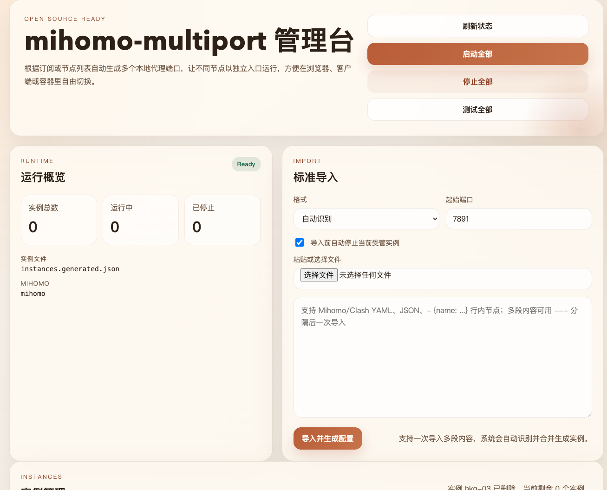

# mihomo-multiport

[中文](./README.zh-CN.md) | English

`mihomo-multiport` turns subscription nodes into multiple fixed local proxy ports, so each node can run as an independent endpoint.

It is built for people who want to:

- import Mihomo / Clash style nodes
- map one node to one local port
- switch nodes by changing port instead of using a GUI selector
- manage everything from a local web console



## Features

- Import Mihomo / Clash YAML, inline node text, and JSON
- Support mixed multi-section import with automatic detection
- Generate one Mihomo config per node
- Start, stop, test, and delete instances individually
- Bulk start / stop / test operations
- Local web console for import and instance management
- Release audit script to avoid publishing local runtime artifacts

## How It Works

After importing three nodes, you get endpoints like:

```text
Node A -> http://127.0.0.1:7891
Node B -> http://127.0.0.1:7892
Node C -> http://127.0.0.1:7893
```

If you access them from Docker containers, you can also use:

```text
http://host.docker.internal:7891
http://host.docker.internal:7892
http://host.docker.internal:7893
```

The generated config uses `mixed-port`, so the same port can serve both HTTP and SOCKS5 clients.

## Requirements

- macOS
- Node.js
- `mihomo`

Install a local Mihomo binary into the project directory:

```bash
cd mihomo-multiport
./install-mihomo-local.sh
```

## Quick Start

Import from a file:

```bash
node ./src/cli.js import --input ./examples/sample-proxies.yaml
```

Import from clipboard:

```bash
./import-from-clipboard.sh
```

Start the web console:

```bash
npm run web
```

Default address:

```text
http://127.0.0.1:8799
```

## Supported Input Formats

### YAML

```yaml
proxies:
  - name: "SGP 01"
    type: ss
    server: example.org
    port: 30401
    cipher: aes-128-gcm
    password: secret
```

### Inline nodes

```text
- {name: JPN 01, server: example.com, port: 20201, type: ss, cipher: aes-128-gcm, password: secret, udp: true}
- {name: USA 01, server: example.com, port: 20251, type: ss, cipher: aes-128-gcm, password: secret, udp: true}
```

### JSON

```json
[
  {
    "name": "USA 01",
    "type": "ss",
    "server": "example.net",
    "port": 30501,
    "cipher": "aes-128-gcm",
    "password": "secret"
  }
]
```

### Mixed sections

Use `---` between sections when you want to paste multiple blocks in one import:

```text
proxies:
  - name: "SGP 01"
    type: ss
    server: example.org
    port: 30401
    cipher: aes-128-gcm
    password: secret
---
- {name: USA 01, server: example.com, port: 20251, type: ss, cipher: aes-128-gcm, password: secret}
```

## Commands

```bash
node ./src/cli.js status
node ./src/cli.js start
node ./src/cli.js stop
npm run proxy:test
```

Compatibility scripts are still available:

```bash
./start-mihomo-nodes.sh
./stop-mihomo-nodes.sh
./test-mihomo-proxies.sh
```

## Generated Files

After import, the project generates:

- `configs/generated/*.yaml`
- `instances.generated.csv`
- `instances.generated.json`

Ports start from `7891` by default, but you can override that with `--base-port`.

## Development

Syntax check:

```bash
npm run check
```

Tests:

```bash
npm test
```

Release audit:

```bash
npm run audit:release
```

## Repository Files

Recommended to keep:

- `README.md`
- `README.zh-CN.md`
- `LICENSE`

## CI

- GitHub Actions workflow: [`.github/workflows/ci.yml`](./.github/workflows/ci.yml)

## zzc_center Integration

This project is registered with the local **zzc_center** platform.

- `/health` follows the platform health contract (probed every 30s by zzc_center)
- `/api/nodes` returns the current list of nodes with port, scheme, running state, proxyUrl, dockerProxyUrl
- `/api/docs` returns a JSON catalogue of every public route
- A 5-minute background monitor probes only the *running* mihomo nodes via Cloudflare trace and sends a DingTalk alert on state transitions (pass→fail / fail→pass) through the project-level `alerts` channel
- Health-status changes detected by zzc_center itself flow into the platform-reserved `health-alerts` channel automatically — do not push business messages there

### Setup

1. Copy `.env.example` → `.env.local`, fill `ZZC_BASE_URL` + `ZZC_API_KEY` (issued from zzc_center admin), `chmod 600 .env.local`.
2. Start the console: `npm run web` (default `127.0.0.1:8799`). On boot it calls `ensureChannels` to clone `alerts` from the global `default` channel if missing, then starts the node monitor.
3. Run the self-check: `npm run zzc:selfcheck` — it validates `/health`, the (skipped) PG/Redis slots, and the `/api/notify` round-trip.

### Tunables

| Env | Default | Effect |
|---|---|---|
| `NODE_HEALTH_CHECK_ENABLED` | `true` | Set to `false` to disable the periodic monitor |
| `NODE_HEALTH_CHECK_INTERVAL_MS` | `300000` (5 min) | Probe cadence; clamped to ≥ 30s |
| `NODE_HEALTH_CHECK_COLD_START_GRACE_MS` | `30000` | Skip nodes that just transitioned to running within this window |
| `NODE_HEALTH_CHECK_CHANNEL` | `alerts` | Override the zzc channel name |

Credentials live only in `.env.local` (gitignored). To rotate, reissue the API key from zzc_center admin.

## License

MIT. See [`LICENSE`](./LICENSE).
